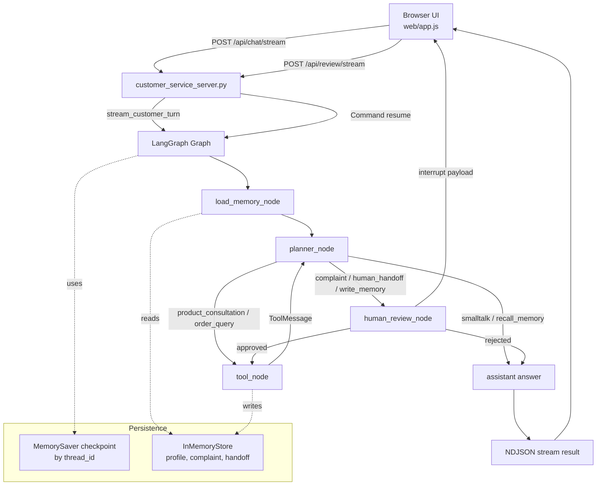

# Support Studio

一个基于 LangGraph 的客服 Agent 实战 Demo，重点演示如何把“意图路由、工具调用、人工审批、恢复执行、跨会话记忆、前端流式调试”串成一个完整应用。

项目使用一套很轻的技术栈：

- LangGraph 负责工作流编排
- 标准库 `ThreadingHTTPServer` 暴露 HTTP 接口
- 原生 HTML/CSS/JavaScript 提供浏览器端测试台
- `MemorySaver` 负责按 `thread_id` 暂停与恢复
- `InMemoryStore` 负责按 `user_id` 存长期偏好和工单数据

这不是一个只停留在命令行里的 toy graph，而是一个可以从浏览器直接体验的业务化 Agent Demo。

## 项目亮点

- 多意图客服路由：支持闲聊、产品咨询、订单查询、投诉处理、人工转接
- Human in the Loop：投诉、转人工、长期记忆写入都会先 `interrupt`
- 暂停后恢复：前端通过 `/api/review/stream` 把审批结果继续送回图里
- 流式可观测：浏览器可以实时看到节点更新；如果回复生成 LLM 可用，还会看到最终回答的 token 级流式输出
- 跨会话记忆：同一个 `user_id` 在新 `thread_id` 下也能召回长期偏好
- 规则回退：没有 API Key 或代理异常时，planner 会回退到启发式路由逻辑
- 本地可运行：产品知识库、订单数据、工单存储都内置在 Demo 里，便于学习和展示

## 演示场景

打开页面后，可以直接用这些话术体验完整流程：

- `你好，今天辛苦了`
- `AeroBuds X1 的续航和保修是怎样的？`
- `我的订单 SO-20260318-1001 现在到哪了？`
- `我要投诉，昨天收到的 HomeHub Mini 外壳有裂痕。`
- `这个问题我想转人工客服处理。`
- `以后请默认用中文回复。`
- `你还记得我的偏好吗？`

## 架构总览



Mermaid 源文件见 [docs/customer-service-agent-flow.mmd](docs/customer-service-agent-flow.mmd)。

## 一次请求是怎么跑的

以“我要投诉，昨天收到的 HomeHub Mini 外壳有裂痕”为例：

1. 浏览器通过 `POST /api/chat/stream` 发送 `user_id`、`thread_id` 和 `message`
2. `customer_service_server.py` 校验请求体后调用 `stream_customer_turn(...)`
3. `advanced_qa_agent.py` 中的 `graph.stream(..., stream_mode="updates")` 开始执行图
4. `load_memory_node` 先读取这个用户的长期偏好
5. `planner_node` 决定当前意图是 `complaint`，并生成 `create_complaint_ticket` 工具调用
6. 因为投诉属于关键操作，流程先进入 `human_review_node`
7. `human_review_node` 通过 `interrupt(...)` 暂停图执行，把审批载荷返回给前端
8. 前端展示审批卡片，用户点击批准或拒绝
9. 浏览器调用 `POST /api/review/stream`，服务端用 `Command(resume=...)` 恢复这条图
10. 如果批准，`tool_node` 真正创建投诉工单，再回到 `planner_node` 生成最终回复
11. 所有节点更新都会以 NDJSON 流式发回前端；如果最终回复由 LLM 生成，浏览器还会收到逐 token 的文本增量

如果你有 Web 后端背景，可以把它理解成：

- `planner_node` 像一个意图路由器
- `tool_node` 像领域服务层
- `interrupt/resume` 像一个可恢复的人工审核关口
- `MemorySaver` 像会话工作流快照
- `InMemoryStore` 像用户画像和工单仓库

## 快速开始

### 1. 准备环境

推荐 Python `3.10+`。

```bash
cd /Users/wilson.zhang/Desktop/agent_engineering_lessons/langgraph-agent-orchestration
python3.10 -m venv .venv
source .venv/bin/activate
pip install -r requirements.txt
```

### 2. 配置模型

项目支持 OpenAI 兼容接口，也支持 DeepSeek。

OpenAI:

```bash
export OPENAI_API_KEY="your-key"
export OPENAI_MODEL="gpt-4o-mini"
# export OPENAI_BASE_URL="https://api.openai.com"
```

DeepSeek:

```bash
export DEEPSEEK_API_KEY="your-key"
export DEEPSEEK_MODEL="deepseek-chat"
# export DEEPSEEK_BASE_URL="https://api.deepseek.com"
```

可选项：

```bash
export LLM_HTTP_TRUST_ENV=false
```

如果你本机挂了代理，且代理链路不稳定，这个变量可以让 LLM 请求不继承环境代理。

如果完全不配 API Key，项目也能运行，只是：

- `planner_node` 会回退到规则路由逻辑
- 最终客服回复会回退到本地模板答案
- 前端仍然保留工作流事件流，但不会出现真正的 token 级文本流

### 3. 启动服务

```bash
cd /Users/wilson.zhang/Desktop/agent_engineering_lessons/langgraph-agent-orchestration
source .venv/bin/activate
python customer_service_server.py --host 127.0.0.1 --port 8000
```

打开浏览器：

```text
http://127.0.0.1:8000
```

## HTTP API

### `GET /api/health`

健康检查接口。

### `POST /api/chat`

非流式单轮聊天。

请求体：

```json
{
  "user_id": "user-wilson",
  "thread_id": "demo-thread-001",
  "message": "我的订单 SO-20260318-1001 现在到哪了？"
}
```

### `POST /api/chat/stream`

流式聊天接口，返回 `application/x-ndjson`。

事件类型包括：

- `update`：LangGraph 节点更新
- `token`：最终客服回复的 LLM token 增量
- `final`：本轮完成后的完整状态快照

```bash
curl -N \
  -X POST http://127.0.0.1:8000/api/chat/stream \
  -H "Content-Type: application/json" \
  -d '{
    "user_id": "user-wilson",
    "thread_id": "demo-thread-001",
    "message": "我要投诉，昨天收到的 HomeHub Mini 外壳有裂痕。"
  }'
```

### `POST /api/review`

非流式恢复审批。

请求体：

```json
{
  "user_id": "user-wilson",
  "thread_id": "demo-thread-001",
  "approved": true,
  "reviewer_note": "允许创建投诉工单"
}
```

### `POST /api/review/stream`

流式恢复审批，继续执行被 `interrupt` 暂停的图。

```bash
curl -N \
  -X POST http://127.0.0.1:8000/api/review/stream \
  -H "Content-Type: application/json" \
  -d '{
    "user_id": "user-wilson",
    "thread_id": "demo-thread-001",
    "approved": true,
    "reviewer_note": "允许创建投诉工单"
  }'
```

## 项目结构

```text
langgraph-agent-orchestration/
├── customer_service_server.py   # HTTP 服务、静态资源、JSON/NDJSON 边界
├── advanced_qa_agent.py         # LangGraph 状态、节点、路由、工具、memory、interrupt/resume
├── web/
│   ├── index.html               # 浏览器测试台
│   ├── app.js                   # 聊天流、审批恢复、调试面板
│   └── styles.css               # UI 样式
├── docs/
│   ├── customer-service-agent-flow.mmd
│   └── customer-service-agent-zhihu.md
└── requirements.txt
```

## 实现要点

### 1. `interrupt` 不是错误处理，而是业务关口

`complaint`、`human_handoff` 和 `write_memory` 都不是普通工具调用，而是有业务风险的关键动作。这里先暂停、再人工确认，比“先执行后补救”更贴近真实系统。

### 2. `thread_id` 和 `user_id` 分工明确

- `thread_id` 用来恢复某一条会话工作流
- `user_id` 用来读取和写入跨会话用户画像

这两个维度拆开后，才容易同时支持“当前流程暂停恢复”和“下次新会话还能记住你”。

### 3. 流式更新比最终答案更有教学价值

前端不是只显示最终回复，而是把每个图节点更新也展示出来。这样在学习 LangGraph 时，能直观看到：

- 当前执行到哪个节点
- 是否进入人工审核
- 执行了哪个工具
- 最终状态为什么会变成 `needs_review` 或 `completed`

### 4. 失败回退是 Demo 完整度的重要部分

项目支持：

- 未配置 API Key 时回退到启发式 planner
- 代理链路异常时给出明确错误原因
- `tool_node` 通过 `RetryPolicy` 演示瞬时故障重试

这让它更像一个“可演示的系统”，而不是只在理想环境下可跑通的样例。

## 当前边界

这个 Demo 适合学习、面试演示和作品集展示，但还不是生产系统。目前的边界包括：

- 数据都在内存里，重启进程后会丢失
- 产品知识库和订单库是内置 mock 数据
- 没有鉴权、权限控制、限流和审计
- 服务端用进程内锁保护共享图对象，适合本地 Demo，不适合多实例部署

## 适合继续扩展的方向

- 把 `InMemoryStore` 换成 Redis、Postgres 或业务数据库
- 给 `tool_node` 接入真实 CRM、订单系统、工单系统
- 把审批链路接到企业 IM 或后台运营系统
- 给前端加入会话列表、历史回放和 trace 视图
- 把单 Agent 工作流继续升级成多 Agent 协作系统

## Contributing

欢迎围绕以下方向继续改进：

- 更真实的客服工具接入
- 更细的可观测性与日志结构
- 更完整的测试覆盖
- 更强的持久化与生产化能力