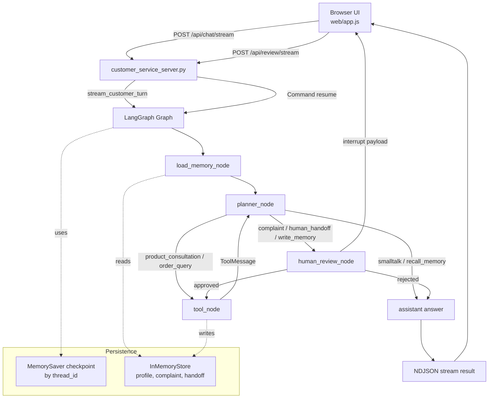

# 把 LangGraph 做成一个像样的项目：我实现了一个可审批、可恢复、可流式追踪的客服 Agent

很多 LangGraph 教程都会停在 `START -> node -> END`，或者做一个很小的 tool calling loop。它们适合入门，但离“一个能演示、能解释、能拿出来放进作品集”的项目还有一段距离。

我这次做的，不再只是一个命令行里的小 Demo，而是一个完整的客服 Agent 实战：

- 浏览器端可以直接发消息
- 服务端暴露 HTTP 接口
- LangGraph 负责状态编排
- 投诉和转人工会先暂停等待审批
- 审批后可以从断点继续执行
- 同一个用户跨会话还能记住长期偏好

如果用 Web 后端的语言来类比，这个项目更像是把“一次聊天请求”拆成了一条可观测、可暂停、可恢复的业务工作流。

## 这次我想解决的不是“能不能调模型”，而是“怎么把 Agent 做得像系统”

真实业务里的客服流程，不是每次都一句话答完就结束。它至少会碰到这几类问题：

- 有的请求其实只是闲聊，不需要工具
- 有的请求要查知识库或查订单
- 有的请求有风险，比如投诉建单、人工转接、写入长期记忆
- 有的请求需要人工确认后再继续
- 前端如果一直等最终答案，用户会觉得系统像卡住了一样

所以这次我把目标定成了一个更工程化的版本：不是单纯回答问题，而是把“路由、执行、审批、恢复、记忆、流式反馈”放到同一条链路里。

## 最终做出来的能力

这个客服 Agent 目前支持：

- 闲聊
- 产品咨询
- 订单查询
- 投诉处理
- 转人工客服
- 长期偏好写入
- 跨会话记忆召回

前端还带一个调试面板，可以直接看到：

- 最近识别出的意图
- 当前执行的工具
- 审批状态
- 图执行过程中的流式事件

这点我很喜欢，因为它让 LangGraph 不再是“黑盒跑一下”，而是一个能被看见的执行图。

## Agent 流程图

如果准备发知乎正文，我建议把这段 Mermaid 渲染成图片再插进去。源码我也单独放了一份：`docs/customer-service-agent-flow.mmd`。

## 一次请求到底怎么走

这里不讲抽象概念，直接按代码调用链走一遍。

### 1. 浏览器发请求

前端入口在 `web/app.js`。

当用户输入一句话，比如：

`我要投诉，昨天收到的 HomeHub Mini 外壳有裂痕。`

浏览器会请求：

`POST /api/chat/stream`

并带上 3 个关键字段：

- `user_id`
- `thread_id`
- `message`

其中：

- `thread_id` 用来标识这条会话工作流，后面恢复执行靠它
- `user_id` 用来标识这个用户，后面读写长期偏好靠它

### 2. 服务端接住 HTTP 边界

服务端入口在 `customer_service_server.py`。

这个文件做的事情很像一个很薄的 API 层：

- 校验请求参数
- 区分 `/api/chat`、`/api/chat/stream`、`/api/review`、`/api/review/stream`
- 把请求转成 LangGraph 能接受的 payload
- 把结果转成 JSON 或 NDJSON 再返回浏览器

如果是聊天请求，它最终会调用：

`stream_customer_turn(...)`

如果是审批后的恢复请求，它最终会调用：

`stream_resume_turn(...)`

### 3. LangGraph 开始跑图

真正的核心在 `advanced_qa_agent.py`。

这里定义了一张状态图，大致是：

`load_memory_node -> planner_node -> (human_review_node | tool_node | END)`

其中最重要的几个节点是：

- `load_memory_node`
- `planner_node`
- `human_review_node`
- `tool_node`

#### `load_memory_node`

先根据 `user_id` 从 `InMemoryStore` 里把历史偏好读出来。

比如用户之前说过：

`以后请默认用中文回复。`

那下一次新会话里，这个节点仍然能把这条长期偏好取出来。

#### `planner_node`

这是整个项目里最像“路由器”的地方。

它不直接负责回答，而是先判断：

- 当前是什么意图
- 要不要调用工具
- 是不是高风险操作
- 要不要写长期记忆

这个节点会优先尝试调用 LLM 做 JSON 决策；如果没有 API Key，或者代理链路有问题，它会自动回退到规则逻辑。

这一点很关键。因为一个真正能展示的系统，不应该只在“网络、模型、Key 全部正常”的理想环境下才能运行。

#### `human_review_node`

如果当前动作是：

- 投诉建单
- 转人工
- 写入长期记忆

流程不会立刻执行，而是先调用 `interrupt(...)`。

你可以把它理解成：图在这里主动打断，把“待审批任务”抛给外层系统。

前端收到这个中断信息后，会展示审批面板。

#### `tool_node`

如果审批通过，或者这个动作本来就不需要审批，流程才会真正进入工具执行。

这里现在接了几类本地能力：

- 产品知识检索
- 订单查询
- 创建投诉工单
- 创建人工接入工单
- 保存长期记忆

工具执行完后，不是直接结束，而是会把 `ToolMessage` 再送回 `planner_node`，由 planner 统一生成最终回复。

这点很像后端里的“服务层做完事情，再由上层组装最终响应”。

## 为什么这套设计比“单次 tool calling”更像业务系统

我觉得主要有 5 个原因。

### 1. 路由和回答被拆开了

很多简单 Agent Demo 会让模型一边判断一边回答，最后代码很难控。

这里我把它拆成两步：

- `planner_node` 先决定下一步该怎么走
- 需要工具时进 `tool_node`
- 工具结束后再统一生成回复

这样整个图的控制权更明确，也更容易加审批、重试和恢复逻辑。

### 2. 人工审批不是补丁，而是图上的一等节点

很多系统是“先执行，再补救”，但客服里的投诉建单、转人工、写长期偏好，都更适合先审后执行。

LangGraph 的 `interrupt/resume` 很适合这种场景，因为它不是把审批写成一堆 if/else，而是把审批本身变成工作流的一部分。

### 3. `thread_id` 和 `user_id` 被明确拆开

我以前刚接触 Agent 工作流时，很容易把“当前会话状态”和“用户长期画像”混在一起。

这次拆开以后，逻辑就清楚很多：

- `thread_id` 管本轮图的断点恢复
- `user_id` 管跨会话的长期偏好

这其实和 Web 系统里“请求上下文”和“用户主数据”分层是一个思路。

### 4. 流式事件让调试体验提升非常大

这次前端没有只等最终答案，而是把每一个图更新都往页面上推。

于是你可以直接看到：

- 现在执行到哪个节点了
- 是不是被人工审批卡住了
- 调用了哪个工具
- 最终是完成了，还是进入 `needs_review`

这在学习 Agent 的时候特别重要，因为很多问题只有把执行过程露出来，才知道错在“路由、工具、审批”里的哪一层。

### 5. 回退逻辑让 Demo 更稳定

这个项目里有两个我很在意的小细节：

- 没有 API Key 时，planner 会回退成启发式规则路由
- 代理环境异常时，会给出清晰的降级原因

这意味着它不是一个“只能在作者电脑上跑通一次”的样例，而是一个别人拉下来之后更容易复现的项目。

## 我觉得最值得复用的几个点

如果你也在做 Agent 项目，我觉得下面这几个设计很值得直接带走：

### 1. 用 HTTP 把图包起来，而不是只停留在 CLI

只要一有 HTTP 边界，这个项目就从“脚本”变成了“服务”。

有了服务，你就能自然衍生出：

- Web UI
- 前后端联调
- curl 测试
- 未来接 IM、后台、BFF

### 2. 把风险动作集中到审批节点

这个模式以后几乎可以复用到所有业务场景里：

- 发邮件前先审批
- 扣费前先审批
- 执行数据库变更前先审批
- 对外发送敏感内容前先审批

本质上，`interrupt` 就像给工作流加了一个“人工事务边界”。

### 3. 把“记忆”拆成两层

不要把所有状态都塞到一条消息历史里。

至少应该区分：

- 当前这轮执行要用的状态
- 用户跨会话长期存在的偏好或画像

这次我用 `MemorySaver + InMemoryStore` 分别承接这两类职责，效果就很清楚。

## 这个项目目前还不是什么

虽然我很喜欢这个版本，但它还不是生产系统。

它现在仍然有明显边界：

- 数据都在内存里，进程重启就丢
- 订单和知识库都是 mock 数据
- 没有权限、限流、审计
- 没有真正的多租户和多实例部署能力

不过也正因为这样，它反而很适合作为学习和作品集项目：复杂度够用，但还没有复杂到让人看不懂。

## 如果你也在学 Agent，我会建议先做这样的“单 Agent 工作流”

我现在越来越觉得，很多人一上来就想做多 Agent，其实容易把问题做大。

更好的路径往往是：

1. 先把一个单 Agent 工作流做完整
2. 让它有 HTTP 接口、有前端、有中断恢复、有状态边界
3. 再往上升级成多 Agent 协作

因为只有你真的经历过：

- 状态怎么设计
- 审批怎么挂进去
- 工具怎么组织
- 响应怎么流出来

你才知道多 Agent 到底是在解决什么新问题，而不是只是多了几个节点和几个名字。

## 下一篇预告：从单 Agent 工作流，升级到多 Agent 协作系统

这一篇我先把“一个像样的单 Agent 系统”搭出来。

下一篇我准备继续往前走两步，重点会写两个方向：

### 1. 多 Agent 协作系统

我会把现在这个“单客服 Agent”升级成一个更像团队协作的系统，比如：

- Router / Supervisor 负责分发任务
- Specialist Agent 负责各自领域
- Agent 之间如何传递上下文
- 哪些状态应该共享，哪些状态应该隔离
- 失败时如何局部恢复，而不是整条链路一起崩

也就是说，下一篇不再只是“一个 Agent 会不会调用工具”，而是“多个 Agent 怎么像服务系统一样协同工作”。

### 2. Skill + MCP

我也会把 Agent 的能力继续模块化，重点拆开看：

- 什么适合做成 skill
- skill 和 prompt/template/tool 的边界是什么
- MCP 怎么把外部工具、文档、数据库、浏览器能力标准化接进来
- skill + MCP 组合起来后，为什么比把所有能力都硬编码进一个 Agent 更可维护

如果说这篇的关键词是：

`workflow`

那下一篇的关键词会更接近：

`system`

也就是从“一个能跑的 Agent”，走向“一个能协作、能扩展、能接生态的 Agent System”。

## 最后

这次做完以后，我对 LangGraph 最大的感受是：

它真正有价值的地方，不只是“能画图”，而是它逼着你把一个 Agent 系统里的状态、边界、暂停点和恢复点想清楚。

一旦这些点清楚了，Agent 就不再像一个玄学黑盒，而更像一个可以被设计、被调试、被演进的后端系统。

如果你现在也在从 Web 工程走向 Agent 工程，我很推荐你先做一个这样的项目。因为它会同时训练你三件事：

- 工作流建模能力
- 系统边界设计能力
- 把 LLM 能力落到真实产品形态里的能力

这几个能力，恰恰比“又接了一个模型 API”更值钱。
